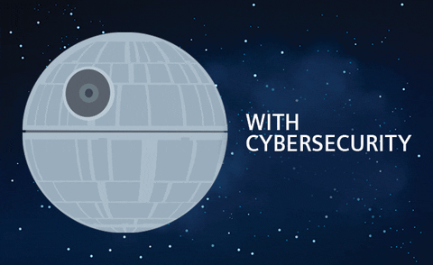

 # WELCOME to Eduardo's GITHUB | PORTFOLIO 

# 🛡️ Cybersecurity Skills

### 🏅 CREDENCIALES OFICIALES — THE BRIDGE

### 🖥️ COMPETENCIAS BÁSICAS

### 👥 PERFILES LABORALES

<!--
**Emcimg/Emcimg** is a ✨ _special_ ✨ repository because its `README.md` (this file) appears on your GitHub profile.

Here are some ideas to get you started:

- 🔭 I’m currently working on ...
- 🌱 I’m currently learning ...
- 👯 I’m looking to collaborate on ...
- 🤔 I’m looking for help with ...
- 💬 Ask me about ...
- 📫 How to reach me: ...
- 😄 Pronouns: ...
- ⚡ Fun fact: ...
-->
